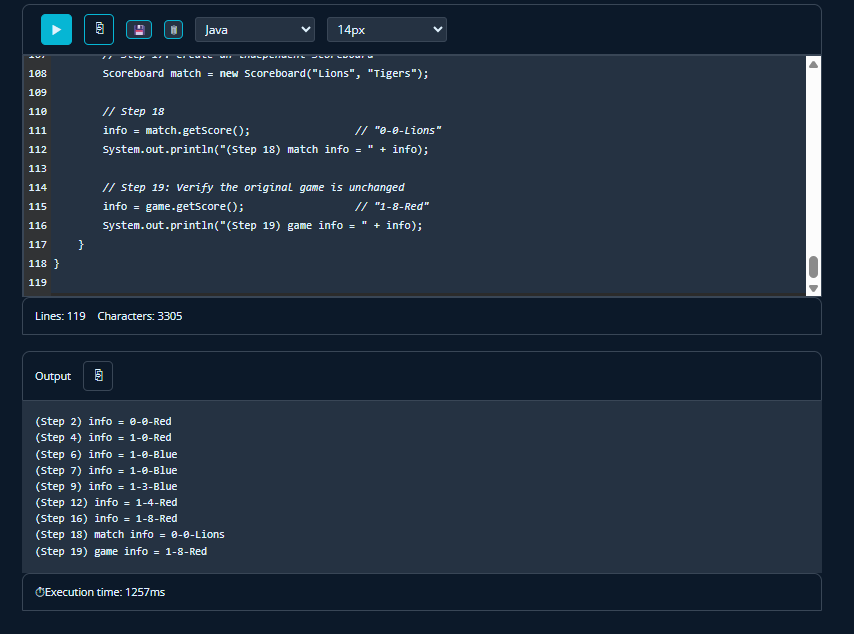

## Proof It Works


## Struggle :()
A thing i struggled with in this assignment was keeping track of the teams that were actuall active ong and making sure that they only changed when something failed. First, I didnt know if the active team should switch after every play or only after plays that fail. Working through example help me understand that scoring play allow the same team to continue, while fail ends the turn and switches team.

## 2024 FRQ #2 – Scoreboard Code

```java
class Scoreboard {

    // Info we need for the game
    private String team1;
    private String team2;
    private int score1;
    private int score2;
    private boolean team1Active;

    // Sets up the game and starts with team 1
    public Scoreboard(String t1, String t2) {
        team1 = t1;
        team2 = t2;
        score1 = 0;
        score2 = 0;
        team1Active = true;
    }

    public void recordPlay(int points) {
        // If points are scored, add them to the active team
        if (points > 0) {
            if (team1Active) {
                score1 += points;
            } else {
                score2 += points;
            }
        } else {
            // If the play fails, switch teams
            team1Active = !team1Active;
        }
    }

    public String getScore() {
        // Find which team is active
        String activeTeam;
        if (team1Active) {
            activeTeam = team1;
        } else {
            activeTeam = team2;
        }

        // Return the score as a string
        return score1 + "-" + score2 + "-" + activeTeam;
    }
}

// Testing the Scoreboard class (DO NOT MODIFY this part unless you change the class, method, or constructer names)
// DO NOT MODIFY BELOW THIS LINE
public class Main {
    public static void main(String[] args) {
        String info;

        // Step 1
        Scoreboard game = new Scoreboard("Red", "Blue");

        // Step 2
        info = game.getScore();
        System.out.println("(Step 2) info = " + info);

        // Step 3
        game.recordPlay(1);

        // Step 4
        info = game.getScore();
        System.out.println("(Step 4) info = " + info);

        // Step 5
        game.recordPlay(0);

        // Step 6
        info = game.getScore();
        System.out.println("(Step 6) info = " + info);

        // Step 7
        info = game.getScore();
        System.out.println("(Step 7) info = " + info);

        // Step 8
        game.recordPlay(3);

        // Step 9
        info = game.getScore();
        System.out.println("(Step 9) info = " + info);

        // Step 10
        game.recordPlay(1);

        // Step 11
        game.recordPlay(0);

        // Step 12
        info = game.getScore();
        System.out.println("(Step 12) info = " + info);

        // Step 13
        game.recordPlay(0);

        // Step 14
        game.recordPlay(4);

        // Step 15
        game.recordPlay(0);

        // Step 16
        info = game.getScore();
        System.out.println("(Step 16) info = " + info);

        // Step 17
        Scoreboard match = new Scoreboard("Lions", "Tigers");

        // Step 18
        info = match.getScore();
        System.out.println("(Step 18) match info = " + info);

        // Step 19
        info = game.getScore();
        System.out.println("(Step 19) game info = " + info);
    }
}

