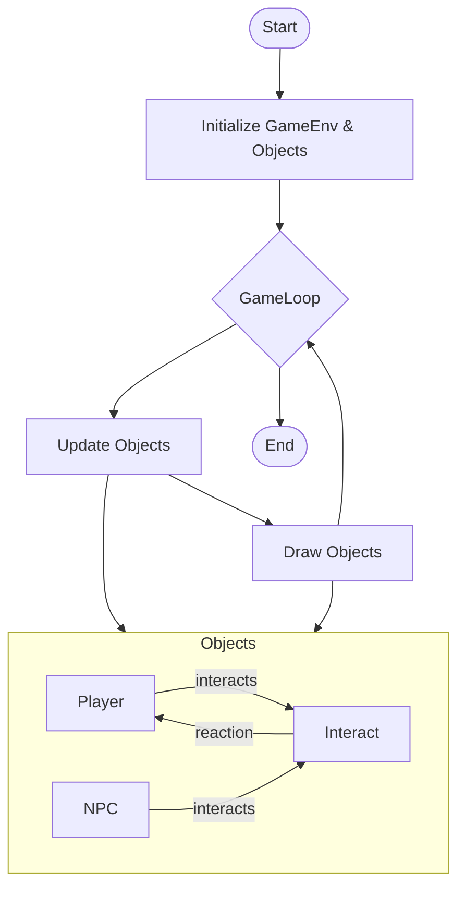

## Overview

GameEnginev1 is built around a central GameLoop that manages updates and rendering for all game objects.  The loop ensures smooth gameplay by repeatedly updating object states and drawing them to the screen.

## Files and Directories

Review these locations in the project to understand the structure and purpose of different files in a project.

```text
/assets/js/GameEnginev1
│
├── essentials: (core files)
│   ├── Background
│   ├── BackgroundParallax
│   ├── Barrier
│   └── ...
├── platformer: (legacy code)
│   ├── Config
│   ├── Enemy
│   └── ...
├── templates: (GameBuilder support) 
│   ├── Attributes: sprite animation, wasd
│   └── Methods: ...
├── 00-v1-Game.md (GameLevel loader)
├── GameLevelDesert (example configuration)
├── GameLevelSquare (default configuration)
└── ...
```

### GameLoop Logic

1. Initialize game environment and objects.
2. Update: Each frame, update all game objects (Player, NPCs, Barriers, Background, etc.).
3. Draw: Render updated objects to the screen.
4. Repeat: Continue until the game ends.

### Primary Classes

* GameObject: Base class for all entities.
* Player: Controlled by the user.
* NPC: Non-player characters with scripted behaviors.
* Background: Visual environment, may include parallax effects.
* GameControl: Handles input and game state.
* GameEnv: Manages global environment settings.

### Interact & Reaction Callbacks

A key feature for customizing gameplay is the interact (or reaction) callback.
Students often define these early when creating new assets or objects.
This callback lets you specify what happens when the player interacts with an object—such as picking up an item, triggering dialogue, etc

## Summary



Summary:
This visual simplifies the key workflow performed by the GameEngine:

* The GameLoop drives the update and draw cycle.
* Player and NPC are examples of objects managed each frame.
* The interact/reaction callback is a core feature for object-to-object interaction.
