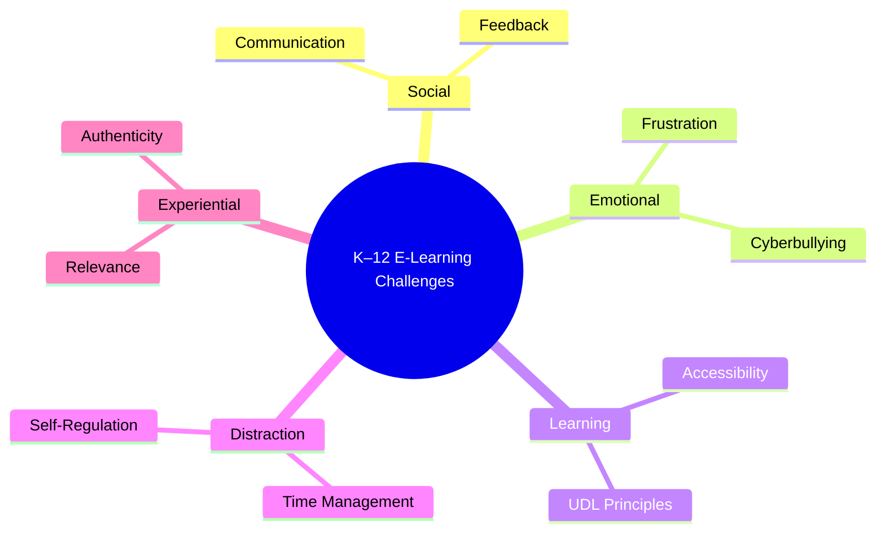

## A1. Introduction

Designing meaningful online learning experiences requires an understanding of the real challenges that K–12 students face when learning in digital environments.  
While WGU materials emphasize empathy for the learner, much of my perspective comes from daily experience teaching **Computer Science and Web Development** through both **in-person and online modalities**.

Over the past 7 years of teaching, 1.5 years of online teaching, I have witnessed the differences between:

- **In-class hybrid instruction**, where students collaborate, receive immediate interaction with peers, and build together.
- **Fully online learning**, where motivation, structure, and emotional engagement must be deliberately designed into the experience, through elements like breakout rooms, and cameo teacher appearences.

Understanding these differences is essential for instructional designers, because *effective digital design is not merely content delivery — it is the architecture of engagement, for social-emotional-learning, and authentic opportunity.*

---

## A2. Challenges and Contrasts

The WGU lessons organize e-learning challenges across social, emotional, learning, and external dimensions.
In my own practice, I have encountered these same themes, often through real examples in coding and project-based instruction.
Below, I highlight how WGU’s theory aligns or contrasts with my classroom experiences.

### A2a. Social Challenges

WGU Emphasis: Providing time for communication and routine feedback.

My Experience:
In my coding classes, collaboration is central. Students learn GitHub workflows, peer review, and agile communication.
In contrast, online learners often miss spontaneous collaboration—chat threads and delayed feedback lack the social immediacy that fosters peer learning.

Contrast:
Where WGU suggests scheduling structured interaction, I have learned to integrate asynchronous community touchpoints such as comment threads on GitHub commits or quick video updates. These allow students to “see” each other’s progress in authentic, project-based contexts.

### A2b. Emotional Challenges

WGU Emphasis: Integrating opportunities to cultivate emotional intelligence.

My Experience:
Emotional regulation is critical in programming. Students frequently encounter frustration during debugging.
In-person, I can read body language and intervene early. Online, those cues disappear, so I use reflection forms and “checkpoint” journaling to surface emotions.

Contrast:
WGU’s guidance aligns with my practice, but I find success in tying emotional awareness to technical problem-solving — teaching students that frustration is a data point, not a failure.

### A2c. Learning Challenges

WGU Emphasis: Using UDL (Universal Design for Learning) as a foundation for course development.

My Experience:
UDL principles — multiple means of representation, engagement, and expression — naturally align with project-based computer science.
Students learn differently: some prefer visual diagrams of systems, others need code examples or tutorials.
I often embed short videos, text prompts, and live coding sessions side-by-side so learners can choose their path.

Contrast:
While WGU emphasizes structural design, I focus on fluid scaffolding: dynamic adaptation based on student pull, rather than fixed course architecture.

### A2d. Learning Distractions (External Challenges)

WGU Emphasis: Explicitly teaching life skills such as time management and organization.

My Experience:
Self-management is the make-or-break factor in online learning.
In computer science, deadlines for commits or sprint tasks can teach real-world time discipline.
I embed agile tools like Kanban boards to make progress visible and self-directed.

Contrast:
WGU’s recommendation feels broad, while my experience shows that project management tools themselves can teach life skills more effectively than separate lessons.

### A2e. Experiential Challenges

WGU Extension: Having authentic learning and outcomes.

My Experience:
Authentic projects — student-built websites, Flask apps, or GitHub Pages portfolios — drive intrinsic motivation far better than quizzes.
Students see their work hosted publicly, connected to professional skills.

Contrast:
WGU emphasizes structure and routine; I emphasize ownership and relevance. Authentic learning transforms routine tasks into personal narratives of capability.

