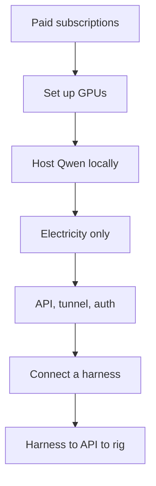

**Research question:** How do we host Qwen3.8 27B so OCS students can code with it, without a paid LLM subscription?

**Problem:** LLM subscriptions are expensive. Not everyone in OCS can use frontier models.

## Communication

**Research goal:** Cut paid AI subscriptions for school work.

**Solution:** Host Qwen3.8 27B locally. The only cost is electricity.

### Team split

- **Team 1:** Nikhil, Adi & Mihir | Inference and API on Rig 1
- **Team 2:** Yash Squared & Anvay | Building Rig 2

## Justification

Harnesses: OpenRouter, Pi, or Claude Code.

## Host & Serve

Serving a model for a whole class is the hard part. We need GPUs, a tunnel, auth, and load handling so the server does not OOM.

Stack: model, kernels / runtime, inference engine, node config, distributed serving, scheduler, networking, autoscaling, observability, reliability, cost.

FlashAttention and vLLM cover the early layers. We still tune for our hardware.

Qwen3.8 27B is strong at coding.

Qwen3.8 27B scores 52. Same as GPT-5.6 Luna (max). Source: [Artificial Analysis](https://artificialanalysis.ai/models/qwen3-8-27b).

SciCode: 45%. GPT-5.6 Luna (max) is at 49%. Source: [Artificial Analysis](https://artificialanalysis.ai/models/qwen3-8-27b).

## Literature

- Book: [Baseten Inference Engineering](https://www.baseten.co/inference-engineering/)
- Metrics: `TTFT` (time to first token), `TPS` (tokens per second), `ITL` (inter-token latency)
- Tracker: [issue #4](https://github.com/Open-Coding-Society/OCS-Intelligence/issues/4)
- Speculative decoding: [Leviathan et al.](https://arxiv.org/abs/2211.17192). Draft tokens, Qwen accepts or rejects. Goal: 60+ t/s.
- Long context: [YaRN](https://arxiv.org/abs/2309.00071). Qwen window is 256k.

### Literature Review

- [Speculative Decoding](https://arxiv.org/pdf/2211.17192)
- [YaRN](https://arxiv.org/pdf/2309.00071)
- [Qwen3.8 27B Model Card](https://huggingface.co/Qwen/Qwen3.8-27B)
- [TD-Pipe: Temporally-Disaggregated Pipeline Parallelism Architecture for High-Throughput LLM Inference](https://arxiv.org/pdf/2506.10470)
- [PipeMax: Enhancing Offline LLM Inference on Commodity GPU Servers](https://arxiv.org/pdf/2605.02189)
- [FlexGen: High-Throughput Generative Inference of Large Language Models with a Single GPU](https://arxiv.org/pdf/2303.06865)
- [HeteGen: Heterogeneous Parallel Inference for Large Language Models on Resource-Constrained Devices](https://arxiv.org/pdf/2403.01164)
- [PowerInfer: Fast Large Language Model Serving with a Consumer-grade GPU](https://arxiv.org/pdf/2312.12456)
- [Efficient Memory Management for Large Language Model Serving with PagedAttention / vLLM](https://arxiv.org/pdf/2309.06180)
- [Orca: A Distributed Serving System for Transformer-Based Generative Models](https://www.usenix.org/system/files/osdi22-yu.pdf)
- [AWQ: Activation-aware Weight Quantization for LLM Compression and Acceleration](https://arxiv.org/pdf/2306.00978)
- [GPTQ: Accurate Post-Training Quantization for Generative Pre-trained Transformers](https://arxiv.org/pdf/2210.17323)
